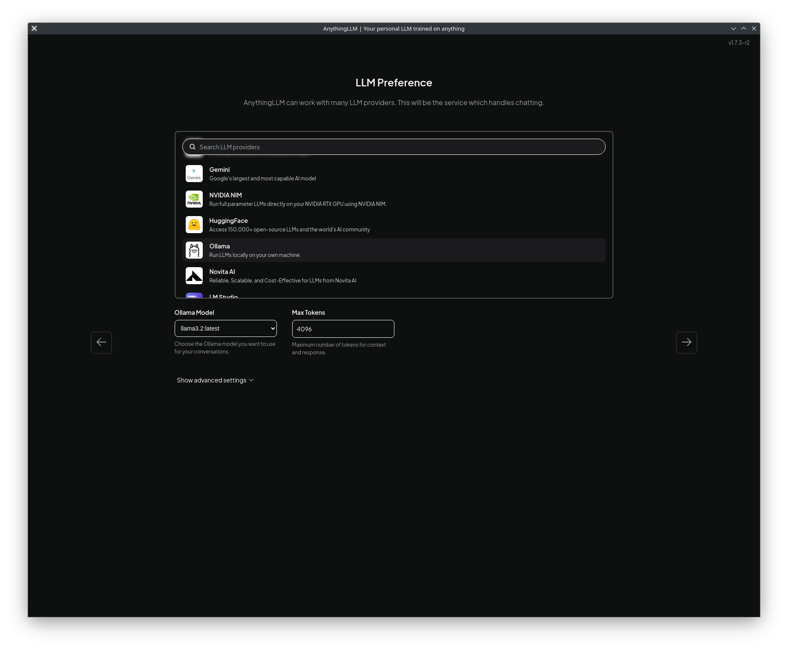

# README.md
## Allmbox
A self-hosted chatbot with graphical frontend using Distrobox container and hardware acceleration. It can run all the models available for Ollama and allows to create multiple instances for different models.

## Dependencies
This repository uses the following dependencies:
- [Oolama](https://github.com/ollama/ollama) for the backend
- [AnythingLLM](https://github.com/Mintplex-Labs/anything-llm) for the frontend

The Distrobox is based on standard Ubuntu 24.04 base image (ubuntu:noble tag).

## Installation Requirements
Before running the installer, make sure you have the following requirements:
- A 64-bit operating system (tested on Fedora 41)
- Podman
- Distrobox
- (optional) AMD GPU for hardware acceleration (tested on series 7000 AMD GPUs, will probably run on older ones, but I'm 99% sure it won't work on NVidia, contributors welcomed)

## Installation Instructions
### Quick cURL installation
Although it's **not recommended** (remember kids, never run random scripts without reading them), if you want just hop in with default settings you can use standard `curl` method of installation:

```bash
curl -fsSL https://raw.githubusercontent.com/Leniwcowaty/allmbox/refs/heads/main/install.sh | sh
```

This will do the same as basic installation, but without pulling the git repo. You can use options and commands (described in **Advanced installation**) with this method by adding `/dev/stdin [command] [options]` at the end, eg.:

```bash
curl -fsSL https://raw.githubusercontent.com/Leniwcowaty/allmbox/refs/heads/main/install.sh | sh /dev/stdin -m deepseek-r1
```

### Basic installation
Make sure you have Podman and Distrobox installed. After that clone the repo from `master` branch and for basic, default installation run `install.sh`

```bash
git clone https://github.com/Leniwcowaty/allmbox.git
cd allmbox
./install.sh
```

Container named **allmbox-llama3.2** will be created and set up with all dependencies, pull and install the default **llama3.2** model (2.0 GB), and a .desktop entry named `AnythingLLM (allmbox-llama3.2)` will be added to your application launcher.

### Advanced installation
Using command options you can use different language models supported by Ollama, as well as install multiple instances of AnythingLLM for different models. To see available command options use `-h` option:

```bash
Usage: install.sh [options]
Options:
  -m model        Which model to use 
  -l              List available models
                    The list of available models is also available on Ollama Github page: https://github.com/ollama/ollama
  -h              Print this help message

Additional commands:
remove          Remove container 
                    If you have only one container, you can run "install.sh remove", with multiple containers use -c option (see install.sh remove -h for help)
```

When using `-m` option to select model, the resulting container will be named `allmbox-[model]`, and will not let you create multiple contaiers with the same model. Similarly, the .desktop entry will be named `AnythingLLM (allmbox-[model])` to make it easier to differenciate between multiple instances.

## Running the Chatbot
You can run AnythingLLM from your application launcher, using `AnythingLLM (allmbox-[model]) entry. Upon first launch you will be greeted by AnythingLLM welcome screen and will be prompted to choose the backend, as shown below.



Choose of course **Ollama**. The app should automatically detect local installation of selected model and allow you to continue. Next steps include summary, opt-in AnythingLLM telemetry and naming your workspace. After that you're good to go.

Per-container AnythingLLM configs are located in `$HOME/.allmbox/[container name]/anythingllm-desktop`

### Why does it take so long to launch?
Normally Distrobox will not stop the container to make subsequent launches faster. However, due to how Ollama works, this would mean having an LLM running in the background at all times, which could impact performance. For that reason .desktop entry is configured in such a way that the container will be stopped after you exit the application.

## Removing the Chatbot
If you used default installation and have only one instance you can simply run:

```bash
./install.sh remove
```
This will remove the container, Allmbox config directory (`$HOME/.allmbox`) and .desktop entry.

If you have more than one instance installed, this command will inform you to use command option `-c`. For further info use `-h` for help:
```bash
Usage: install.sh remove [options]
Options:
  -c container    Which container you want to remove
  -l              List all allmbox containers
  -h              Print this help message
```

Then just use `-c` to select which container you want to remove.

## Contributing to the Project
Contributions are welcome! If you'd like to help with the project, please fork this repository and submit a pull request. If you want you can rebase it to other distro, or provide a build Dockerfile which will work for NVidia (I don't have NVidia card, so I can't test).

## License
This repository is hosted under the [MIT license](https://opensource.org/licenses/MIT) created by leniwcowaty. By contributing to this project, you agree to be bound by the terms of the MIT license.

## Important notice about this project!
This is my personal passion/learning project. I'm in no shape or form a developer, Docker/Podman specialist, and have very basic knowledge about Bash scripting. As a result - this is not 100% guaranteed to be fool-proof, stable and reliable. I will try to learn, evolve and make this project better, but as of right now - it's just a hobby for me.